# 桌面環境 Desktop Environment

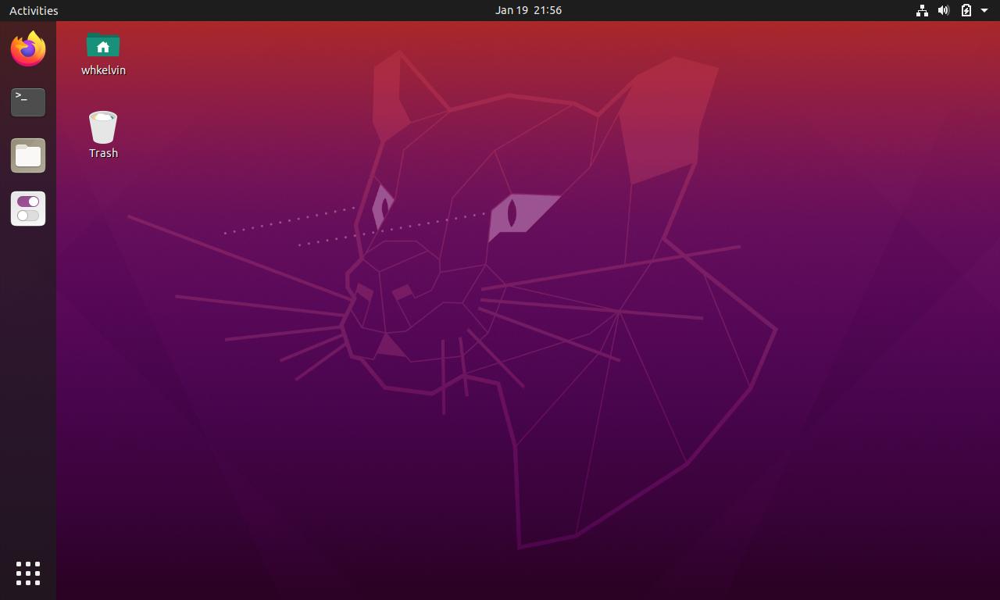

桌面環境是什麼呢？簡單的說他就是你開機之後會看到的 UI。Ubuntu20.04 預設的桌面環境是[Gnome](https://www.gnome.org/)， 上圖螢幕左邊的 Apps 還有上面的狀態列（中間有時間，旁邊還有一些音量按鈕的那個）都是 Gnome DE(Desktop Environment)的一部分。當然，如果你不喜歡 Gnome DE, Ubuntu 還有很多不同的版本，每個版本都用不同的 DE, 像是 Kubuntu(KDE), Xubuntu(Xfce)等等。萬一你已經安裝了原味的 Ubuntu 也不用擔心，並不需要重新裝一個新的。可以直接在原味的 Ubuntu 裡裝不同的 DE，然後在登入的時候就可以選要用哪一種口味啦。

~~這不是肯德基~~ 剛裝好 Ubuntu 的時候覺得預設的桌面蠻酷的，不過五分鐘之後就迫不及待對他動手動腳.... Linux 和 Mac OS & Windows 最大的不同的地方就在於看到不喜歡的東西全部通通都可以改，不想看到的東西也可以藏起來。你想要的話也能今天讓你的桌面還有視窗看起來像[Mac OS](https://itsfoss.com/make-ubuntu-look-like-macos/)，明天看起來像[Windows](https://www.makeuseof.com/tag/make-linux-look-like-windows/)，不過幹麻跟自己過不去？ 既然都在看這篇了不如自己做出一個屬於你自己的獨一無二的桌面，讓坐你隔壁的帥哥妹子下巴都掉下來嘿嘿。

## Gnome 主題設置

### Application Theme

這是預設的主題:
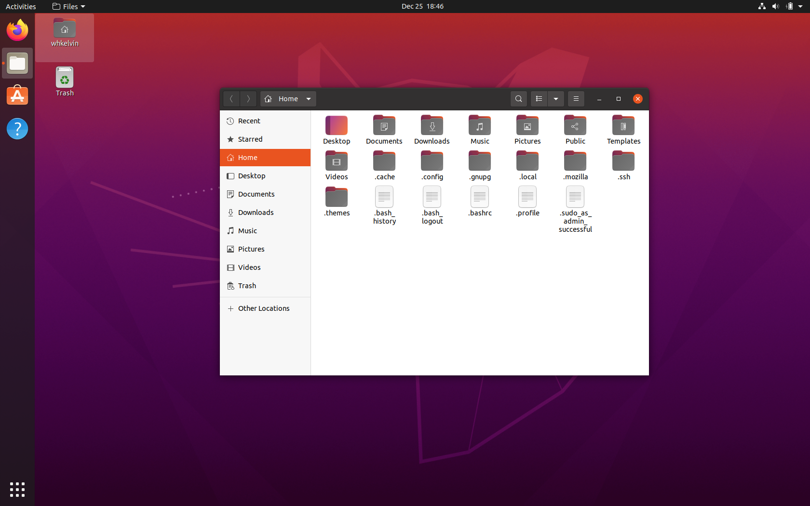
這是改完之後的樣子:
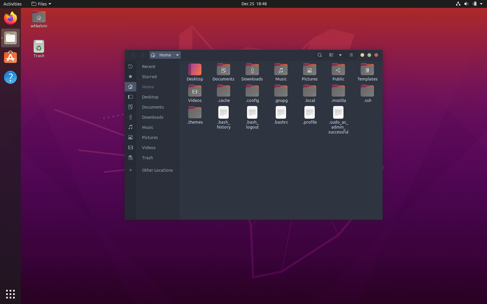

首先我們要安裝 gnome-tweaks:
gnome-tweaks 是一個提供預設的設定裡沒有的選項的設定程式，我們會用他來更換主題。打開你的 Terminal(終端)!

將 universe repo 加到 apt 裡：

`sudo add-apt-repository universe`

然後輸入密碼，然後 enter。sudo 指令之後都會需要打密碼。你打密碼的時候既不會出現星號也不會顯示你的密碼，你要相信，相信 Terminal 有在聽你打字。按 enter 的時候大聲喊三聲芝麻開門~~隔壁就會傳來異樣的眼光。~~

更新 apt 裡的 package:

`sudo apt update`

更新系統裡的軟體:

`sudo apt upgrade`

安裝 gnome-tweaks

`sudo apt install gnome-tweaks`

-   apt 是 Ubuntu 的 package manager， 有點類似 Google Play 或 App Store
-   sudo 是一個讓你在 terminal 暫時提高權限的指令。

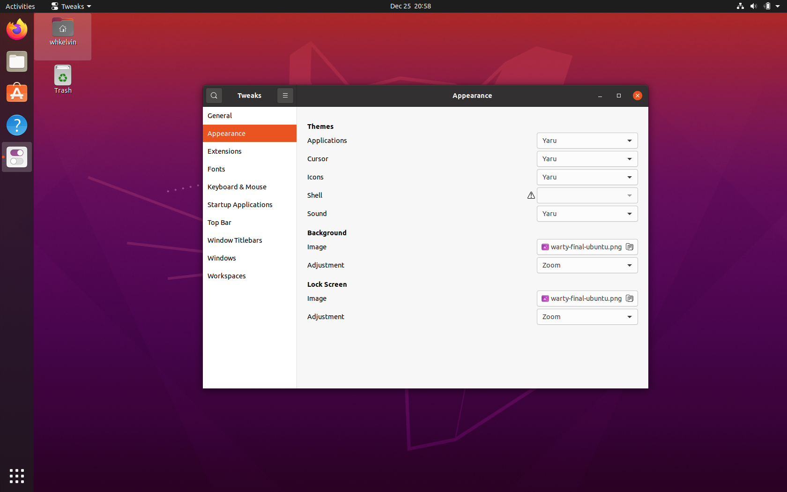
打開 tweaks 之後可以到 Appearance->Themes->Application 選擇你喜歡的主題。

如果想要 nord 的顏色的話， 可以到[這裡](https://www.gnome-look.org/p/1267246/)下載（我選 nordic-darker， 你可以選你喜歡的）。下載下來的檔案解壓縮之後放到`~/.themes` 裡。

**注意**

-   `.themes`這個資料夾不存在的話你會需要建一個新的資料夾，而所有檔名是`.`開始的都會被藏起來。在 Files 裡記得顯示隱藏的檔案。

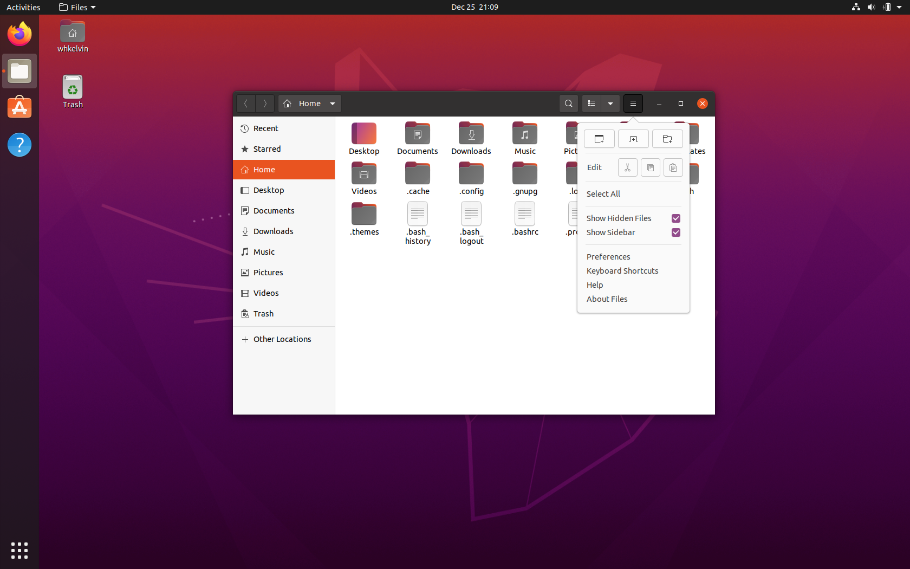
我的`~/.themes`長這樣。
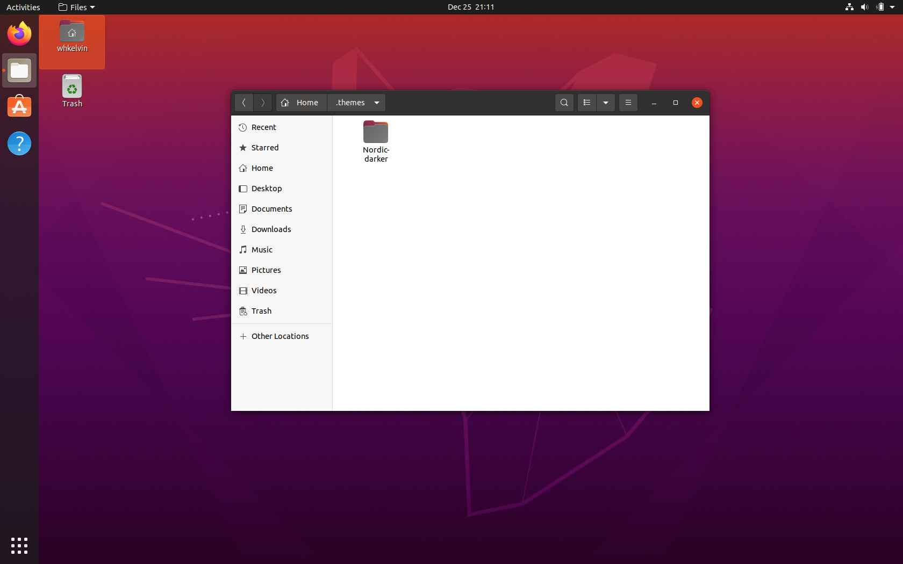
然後從重新打開 tweaks->Appearance->Themes->Application 就應該可以看到新的主題啦。
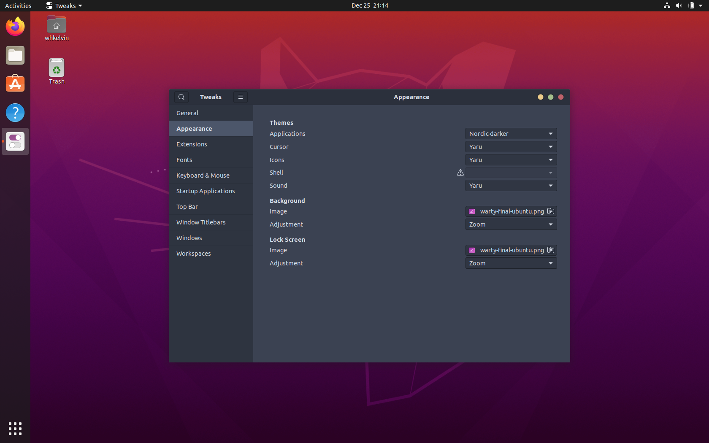

### Icon Theme

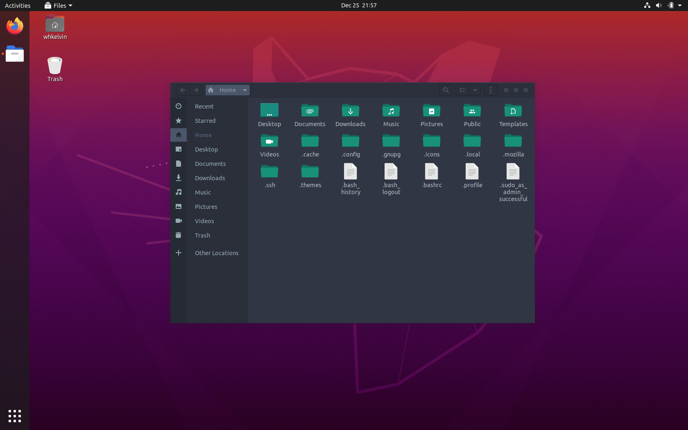
沒有錯，連 App 的 Icon 都可以改。我用的 Icon Theme 是[這個](https://www.opendesktop.org/p/1012431)
我選的是 05-Flat-Remix-Green-Dark，注意左側 Apps 的 icons 還有檔案的圖片都不一樣了。一樣把下載下來的檔案解壓縮放到`~/.icons`裡。之後就可以在 tweaks->Appearance->Themes->Icons 裡面看到啦！

**注意:**

-   **`.icons`這個資料夾不存在的話你會需要建一個新的資料夾，而所有檔名是`.`開始的都會被藏起來。在 Files 裡記得顯示隱藏的檔案。**

-   **我解壓縮完的時候發現要把解出來的檔案夾裡的檔案夾貼到`~/.icons`才行。**

### Dash to Dock

最後再來分享個小撇步，可以讓你把原本在左邊的 App Bar 移到下面，然後縮小一點。
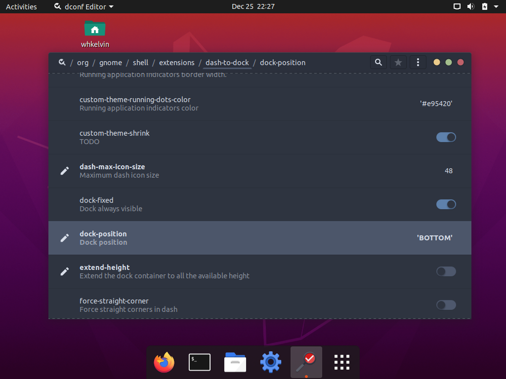

**注意:**

-   小心不要不小心在 dconf-editor 改到不該改的東西，不然電腦不理你了不要怪我。

安裝 dconf-editor

`sudo apt install dconf-editor`

安裝完之後打開 dconf-editor。
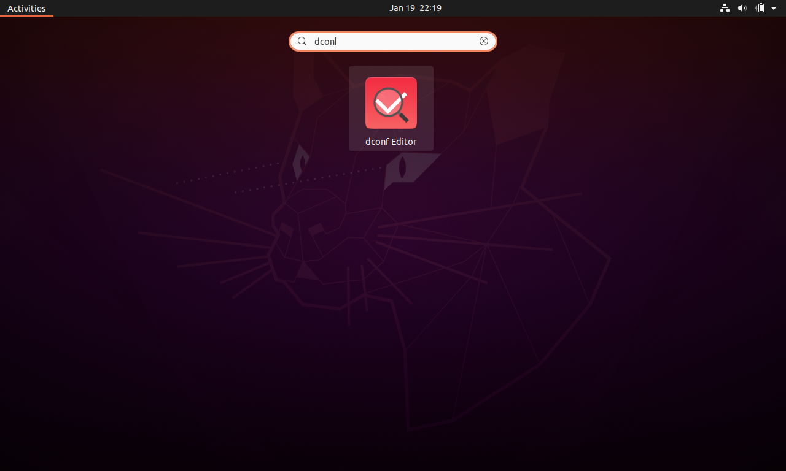

選擇 org/gnome/shell/extentions/dash-to-dock/dock-position，然後把"use default value"關掉, 把"custom value"設成"BOTTOM", 之後按 Apply。
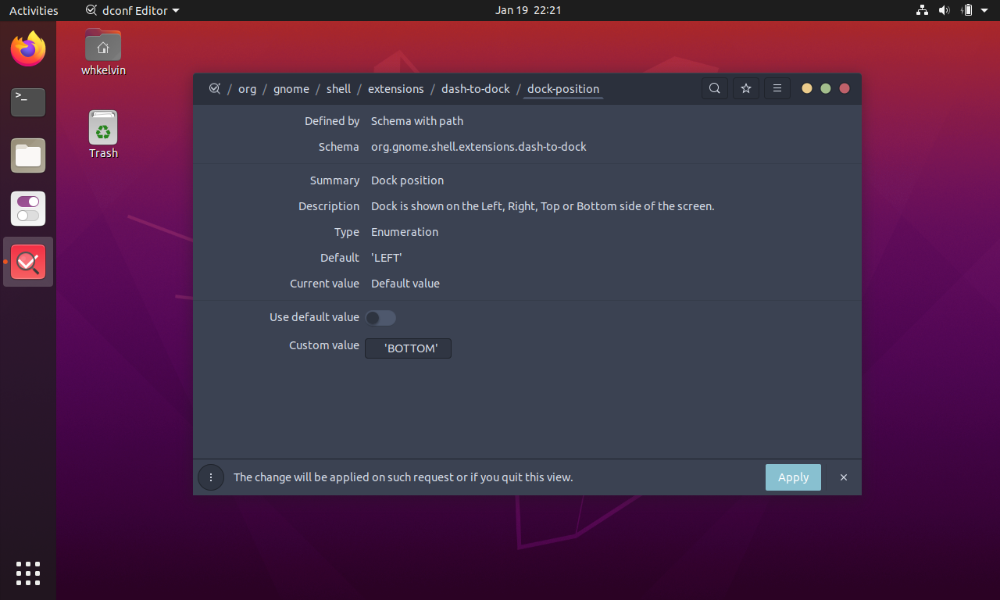

選擇 org/gnome/shell/extentions/dash-to-dock/extended-height，然後把"use default value"關掉, 把"custom value"設成"false", 之後按 Apply 就完成啦~
