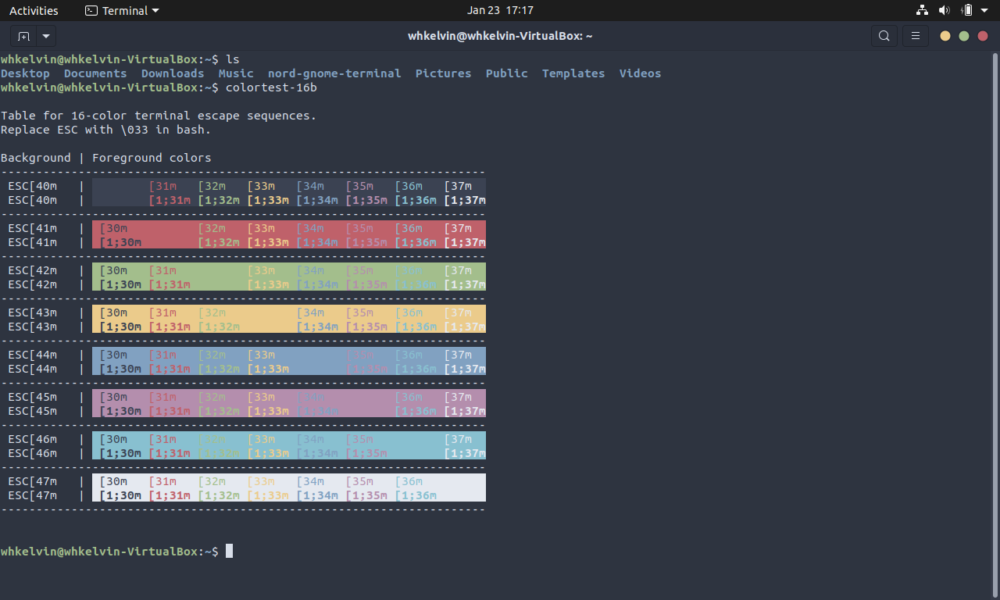
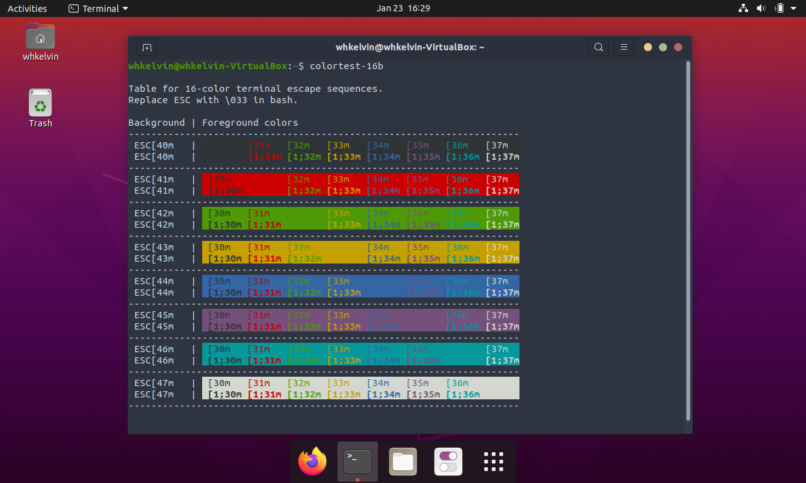
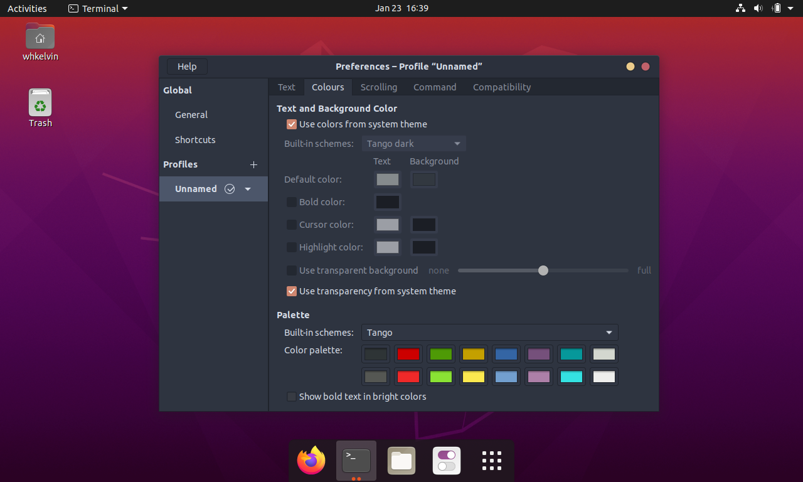
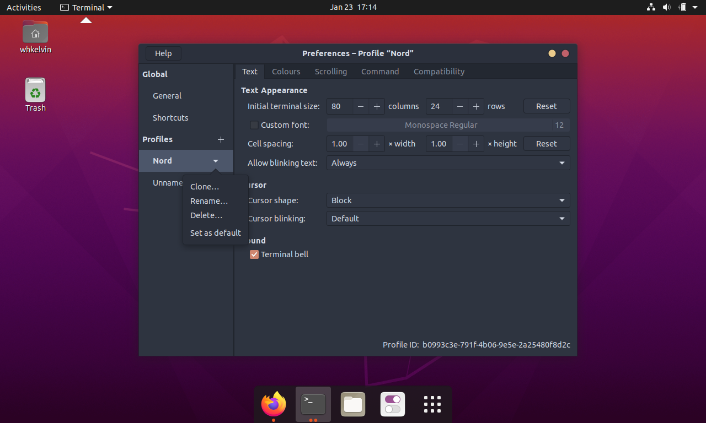

# Gnome Terminal 主題

Gnome Terminal 是 Ubuntu 20.04 預設的 Terminal。 今天要和大家分享的是如何將 Gnome 終端的主題換成 nord!

預設的 Gnome 終端長這樣:

背景和視窗顏色和你的不一樣是因為我把 Application Theme 設成了 nordic darker。可以先看[這篇](/gnomeDesktopEnvironment)。

Gnome Terminal 支援了 16 種顏色, 8 種背景色，8 種前景色。為什麼只有 16 種？我也不知道（喂。這些顏色會被以後介紹到在 Terminal 裡跑的程式用到，所以先改起來放囉。

右上角的三條線菜單按一下，選擇 preferences, 然後在左邊選單裡的 Profiles 選擇 Unnamed，再選擇 colours 就可以看見下圖。下方的 16 種顏色都可以改，不過我會直接用[nord](https://github.com/arcticicestudio/nord-gnome-terminal)。

打開你的 Terminal:

先 Clone nord 主題的 repo:

`git clone https://github.com/arcticicestudio/nord-gnome-terminal.git`

**注意：如果沒有裝 git 的話先安裝 git**

`sudo apt install git`

Clone 完之後可以列出目前資料夾的檔案。應該會看到 nord-gnome-terminal：

`ls`

下載完後進入 repo：

`cd nord-gnome-terminal/src`

最後跑 nord-gnome-terminal 的下載 script:

`./nord.sh`

成功的話就會看到[SUCCESS] 之類的訊息。失敗的話可能是因為有些 dependencies 沒有裝,建議先去看[這篇](/gnomeDesktopEnvironment)。這篇有寫怎麼裝 dconf-editor。dconf-editor 是其中一個 dependencies。

回到 Gnome Terminal, 右上角的三條線菜單按一下，選擇 preferences, Profiles 底下就會出現 Nord 啦！

點一下 Nord，再點一下旁邊的小箭頭，選擇 Set as default 設成預設主題就可以啦！

裝完可以去把剛剛 clone 下來的 repo 刪掉。打開你的檔案管理員找到 nord-gnome-terminal 就可以刪囉。如果有造著上面的步驟，nord-gnome-terminal 的檔案夾應該在 Home 裡。

BTW，在上圖裡顯示顏色條的 command 是：

`colortest-16b`

用 apt 安裝 colortest 之後就可以用囉。

`sudo apt install colortest`
