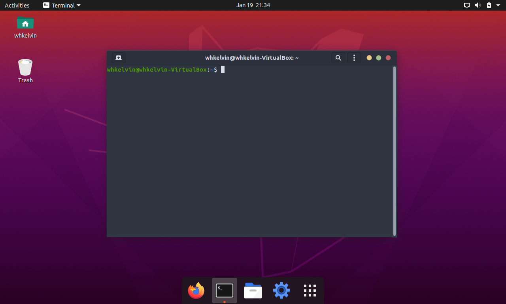

# 虛擬終端 Terminal Emulator

## Terminal? Shell? Prompt? 到底是什麼？

剛開始用 Linux 的時候完全搞不清楚什麼是 Terminal Emulator 什麼是 Shell，反正一開始都用預設的，也不覺得有什麼問題。後來慢慢熟了之後才開始踏出舒適圈，去查各種專有名詞，試試預設外的別種選擇，然後變得越來越挑食... 總之覺得在跳進終端的世界裡之前好像要解釋一下 Terminal Emulator & Shell 有什麼不同。

Terminal（Terminal Emulator）是一個你可以對你的電腦上下其手的地方>///<。在 Terminal 裡面你可以下各種指令來和你的電腦互動，像是列出電腦裡有什麼檔案之類的。Terminal 提供的只是一個介面，讀取你鍵盤的輸入，還有顯示每個指令的結果。

每個 Terminal 裡面都住了一個 Shell，這個 Shell 就是實際去執行你的指令的傢伙。有寫過 Python 的可能知道，Python 也有一個 Python Shell，不過 Python Shell 應該只能接受 Python 的指令。

而 Prompt 就是每一行行首的"使用者名稱@主機名"那一串。每一個 Shell 都有不一樣的 Prompt。

Ubuntu 20.04 預設的 Terminal 是 Gnome Terminal， 而預設的 Shell 是 Bash。
Mac OS 裡也有 Mac Terminal， 預設的 Shell 也是 Bash，不過好像似乎最近有換。
Win 10 我是用 Windows Terminal，預設的 Shell 應該是 powershell。

Terminal 和 Shell 的選擇千百種，可以自己去 Google 挑，當然要有小三也不是不行，畢竟小孩紙才做選擇嘿。參考我的推薦也可以，反正 Linux 推崇的就是共享(貴圈真亂。
