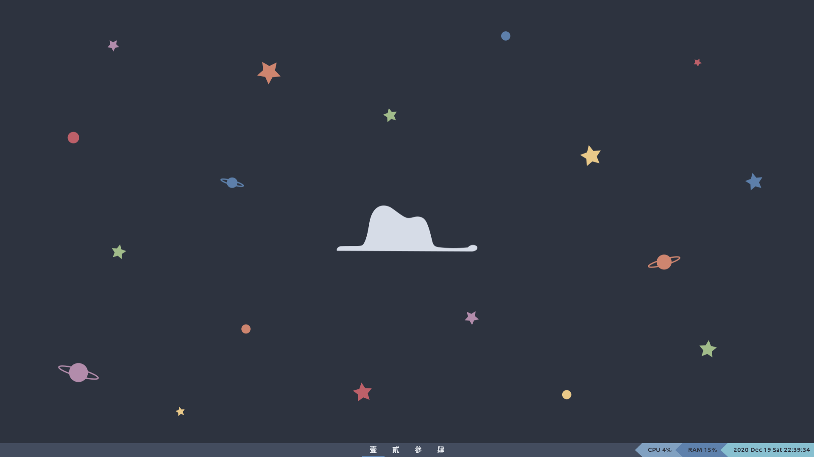

# Hello World!

# 簡介
2021-Jan-14更新：因為這篇越寫越多，所以決定把這篇變成半介紹型索引文，順便把內容拆成小篇一點，比較好消化！

各位看到上面兩張圖就手癢的同學你們好！我絕對不會和你們說我在 Dcard 上發文發現有了一個小粉絲後， 就迫不及待加興高采烈的跑來寫一篇新手+懶人向教學文， 順便介紹一下我的 set up。那就廢話不多說先上 TOC 囉。

- [作業系統 Operating System](#operating-system)
- [Nord 主題 Nord Theme](#nord-theme)
- [桌面背景 Wallpaper](#wallpaper)
- [桌面環境和視窗管理員 Desktop Environment and Desktop Manager](#desktop-environment-and-window-manager)
- [虛擬終端 Terminal Emulator](#terminal-emulator)

# 作業系統 Operating System

[Ubuntu 20.04.1 LTS](https://ubuntu.com/download/desktop) (舊一點的應該也沒問題， 只要是 Linux 基本上都可以[Android 別鬧]， 這篇會以 ubuntu 為主， 其他 Distro 請到樓下的官網自己爬文謝謝)

Mac & Windows - ~~丟掉你的電腦， 我是說微軟或 Apple 拜託請我~~ 如果想試試 Linux 可以裝[Virtual Machine](https://www.virtualbox.org/) 或是 [Dual Boot](https://zh.wikipedia.org/wiki/%E5%A4%9A%E9%87%8D%E5%BC%95%E5%AF%BC)，想看Mac的教學可以~~資助我一台 Macbook~~

Mac & WSL - 有一些 Terminal Emulator 裡的程式是有支援的， 請到樓下的官網自己爬文謝謝

# Nord 主題 Nord Theme

[官網](https://www.nordtheme.com/ports)
[Github Repo](https://github.com/arcticicestudio/nord)

這麼美的主題我還不用爆。[官方支援](https://www.nordtheme.com/ports)的程式超多， 官網上列的有些還沒有內容其實都在 github repo，可以去找找。我的配色很多也是參考（ㄔㄠ ㄒㄧ ˊ）他們的調色盤。非官方的主題也不少， 像是瀏覽器的[主題](https://chrome.google.com/webstore/detail/nord/abehfkkfjlplnjadfcjiflnejblfmmpj/reviews)等等。順帶一提， 還在用 Google Chrome、 Edge、和 IE(???)的大大們， 該換[瀏覽器](https://brave.com/)囉。以後寫一篇文專門為大家講解 Brave Browser(喂。

# 桌面背景 Wallpaper

我自己用[Inkscape](https://inkscape.org/)畫的， 麻煩到[這裡](https://github.com/whkelvin/MyUbuntuSetUp/issues)稱讚我。(~~就你 issues 最多~~)

PNG 和 SVG 檔都在[這裡](https://github.com/whkelvin/MyUbuntuSetUp/tree/master/Pictures)， 如果賣出去拜託讓我抽個成我的學貸還不完 QAQ

# 桌面環境和視窗管理員 Desktop Environment and Desktop Manager
如果你還不知道什麼是桌面環境，建議你先看這篇[Gnome 桌面環境](/gnomeDesktopEnvironment)，如果你跟自己過不去，可以直接看這篇TODO!

<a name="terminal-emulator"/>

# 虛擬終端 Terminal Emulator
剛開始用 Linux 的時候完全搞不清楚什麼是 Terminal Emulator 什麼是 Shell，反正一開始都用預設的，也不覺得有什麼問題。後來慢慢熟了之後才開始踏出舒適圈，去查各種專有名詞，試試預設外的別種口味，然後變得越來越挑食... 總之覺得在跳進終端的世界裡之前好像要解釋一下 Terminal Emulator & Shell 有什麼不同。

Terminal（Terminal Emulator）是一個你可以對你的電腦上下其手的地方>///<。在 Terminal 裡面你可以下各種指令來和你的電腦互動，像是列出電腦裡有什麼檔案之類的。Terminal 提供的只是一個介面，讀取你鍵盤的輸入，還有顯示每個指令的結果。

每個 Terminal 裡面都住了一個 Shell，這個 Shell 就是實際去執行你的指令的傢伙。

Ubuntu 20.04 預設的 Terminal 是 Gnome Terminal， 而預設的 Shell 是 Bash。
Mac OS 裡也有 Mac Terminal， 預設的 Shell 也是 Bash，不過好像似乎最近有換。
Win 10 我是用 Windows Terminal，預設的 Shell 應該是 powershell。

Terminal 和 Shell 的選擇千百種，可以自己去 Google 挑，當然要有小三也不是不行，畢竟小孩紙才做選擇嘿。參考我的推薦也可以，反正 Linux 推崇的就是共享(貴圈真亂。

注意：很多在 Terminal 裡面跑的程式都會用到 Terminal 裡設置的顏色，所以建議要先把 Terminal 的主題換成 Nord。

下列是所有出現在上圖的酷東西:
- [Alacritty: TODO](): 我目前用的Terminal
- [Fish: TODO]():我目前用的Shell
- [Powerline: TODO](): 左上角Terminal裡輸入指令前面的那個藍色箭頭酷東西
- [neofetch: TODO](): 左上角Terminal顯示Ubuntu的Logo的程式
- [cmatrix & unimatrix: TODO](): 右上角駭客任務裡的動圖程式
- [cava: TODO]():右下角的音樂動態條狀圖

左下是我的檔案總管, 可以去看[Gnome 桌面環境](/gnomeDesktopEnvironment)。
